# Tom Rexington, Esq.: Bates & Destroy — art build

Procedural art pipeline for the game. Three deliverables, one toolchain:

| | What | Build |
|---|---|---|
| **Viewmodel** | FPV arms + Exhibitfy Bates stamp, `Stamp_Swing` animation | `build_fpv_arms.py` |
| **Enemies** | Four anthropomorphic legal documents, each with `Run` + `Stamped` | `build_enemies.py` |
| **Environment** | Seven-piece modular law office kit | `build_environment.py` |
| **Prototype** | Playable first-person slice in the browser | [`web/`](web/) |

Everything is generated by dependency-free Python — geometry, UVs, PBR
textures, animation, GLB export, and the preview renders. No DCC app and no
third-party packages.

**To play it:** serve the repo root and open `/web/`.

```bash
python3 -m http.server 8000     # from the repository root
```

<http://localhost:8000/web/> — WASD to move, mouse to look, left click to
stamp. See [`web/README.md`](web/README.md).


---

# 1. Viewmodel — FPV arms + Exhibitfy Bates stamp

First-person viewmodel. Forearms only — no body, no head — in rolled-up white
dress shirt sleeves, both hands on a heavy Exhibitfy Bates numberer, plus a
baked **`Stamp_Swing`** slam.

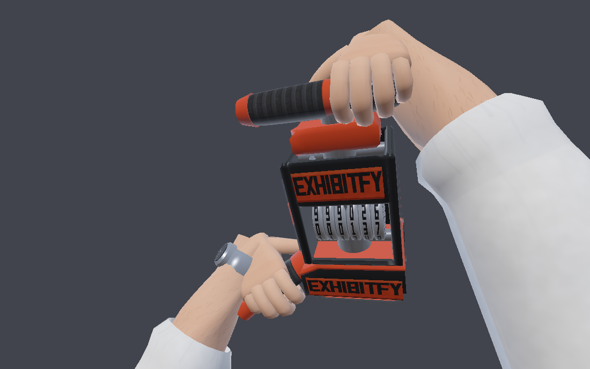

Everything is generated by a dependency-free Python build: geometry, UVs, PBR
textures, the animation, the GLB, an editable quad OBJ, and the preview
renders. No DCC app or third-party package is needed to reproduce or re-tune it.

```bash
python3 build_fpv_arms.py                 # full build + previews (~3.5 min)
python3 build_fpv_arms.py --no-preview    # geometry + animation only (~50 s)
python3 build_fpv_arms.py --bates 001842  # change the number on die + wheels
python3 -m tools.validate_glb build/exhibitfy_fpv_arms.glb
```

---

## What ships

| File | What it is |
|---|---|
| `build/exhibitfy_fpv_arms.glb` | Runtime asset. glTF 2.0, PBR metallic-roughness, textures embedded, `Stamp_Swing` animation baked in. 16 objects. |
| `build/exhibitfy_fpv_arms_single_mesh.glb` | **Same geometry as one object**, 13 material slots, no animation. Use this to inspect or edit the model. |
| `build/exhibitfy_fpv.obj` + `.mtl` | Editable copy with **quads preserved** (static ready pose). |
| `build/textures/*.png` | Every map as authored (17 files), also embedded in the GLB. |
| `build/previews/stamp_swing.png` | **Animated PNG** of the full swing — open it in a browser to watch it play. |
| `build/previews/stamp_swing_frames.png` | All 23 frames as a contact sheet. |
| `tools/blender_stamp_swing.py` | Blender-side setup: fps, frame range, action naming. |

**Budget:** 12,866 triangles / 5,728 quads / 8,592 vertices, 17 textures.
Comfortably inside a mobile viewmodel budget — viewmodels draw once per frame
in their own pass, and 8–15k is the usual allowance for hands + weapon.

**Conventions:** metres, Y-up, camera at the origin looking down −Z (glTF
convention). The rig is authored in view space, so dropping it into a viewmodel
camera with an identity transform gives you the framing above.

---

## `Stamp_Swing`

**23 frames @ 30 fps (0.767 s).** One scalar drives the whole motion, so the
timing is readable and tunable in one place (`SWING` in `build_fpv_arms.py`).

| Frames | Beat | What happens |
|---|---|---|
| 0 | Ready | Ready stance, identical to the static bind pose |
| 1–4 | Wind-up | Short, powerful cock back **and up**, ease-out so it snaps into the loaded position |
| 5 | Load | One held frame — the anticipation beat |
| 6–10 | Slam | Accelerating drive forward and down (`t^2.6`), no linear drift |
| **11–13** | **Impact** | **3 frames planted.** The die sits *in* the plane and presses 2.2 → 3.0 mm deeper across the hold |
| 14–22 | Recovery | Controlled, monotonic return. No rebound, no overshoot |

Frames 0 and 22 are **bit-identical** to the ready pose, so the clip loops and
blends cleanly.

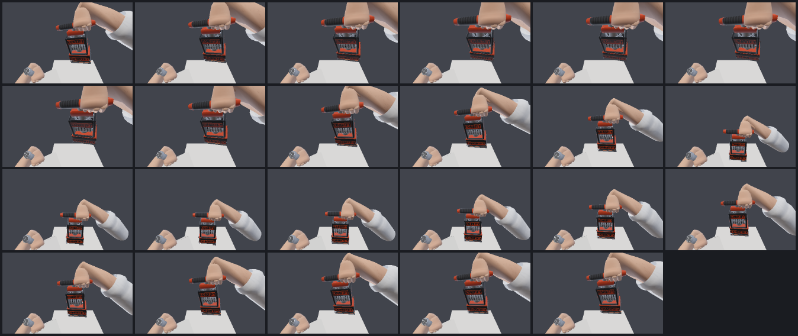

`build/previews/stamp_swing.png` is an APNG of the same frames — open it in a
browser to watch the swing at speed.

### Why it reads as heavy

- **No bounce.** The die does not rebound off the surface; it presses further
  in across the hold. Rebound is what makes a hit read as light.
- **Asymmetric timing.** 5 frames of acceleration into the hit, 9 frames to
  recover. Fast in, slow out.
- **Wrist lag.** The forearms are allowed to lag the hands proportionally to
  swing velocity (±8.5°), which gives follow-through without the wrist
  geometry pulling apart. Tapered to zero at both ends of the clip.
- **Grip squeeze.** Fingers curl an extra 5.5° at the moment of impact.

### The impact plane

The stamp's local origin **is** the striking face, so the hit is exact by
construction rather than eyeballed: at the impact frame the stamp node sits on
the plane point with its +Y along the plane normal, and the face lands flush.

Two locators ship in the GLB for hooking up effects:

| Node | Use |
|---|---|
| `Impact_Plane` | Root-level locator at the impact point. **+Y is the plane normal.** Spawn the paper/desk here, or use it to place your own surface. |
| `Stamp_DieAnchor` | Child of the stamp, on the die face. **+Y points out along the strike direction.** World scale is 1. Attach the ink decal, particles and impact audio to this. |

Trigger on frame 11. `IMPACT` in `build_fpv_arms.py` defines the plane; move it
and the whole swing retargets, including how far the arms reach.

The white sheet in the preview renders is a **debug object only** — it is never
exported. The game places its own surface using `Impact_Plane`.

### Two GLBs, and which to open

The rigged file is **16 separate objects** — that is what makes it animatable,
since glTF drives animation per node. It also means a DCC opens it as 16
objects and **Edit Mode only ever shows the one that is active**: tab into a
finger and you get ~140 quads, which looks like "a tiny cluster of vertices"
even though the file is whole.

If the model looks incomplete in Edit Mode, open
`exhibitfy_fpv_arms_single_mesh.glb` instead — one object, everything in it.
Or in the rigged file, select all (`A`) in Object Mode; Edit Mode with several
objects selected shows them all.

Both files are verified to contain identical geometry — 8,592 vertices,
12,866 triangles, bounds 0.616 × 0.751 × 0.382 m — by
`tools/glb_roundtrip.py`, which rebuilds world-space triangles from the
exported file's own accessors and node transforms rather than from the build:

```bash
python3 -m tools.glb_roundtrip build/exhibitfy_fpv_arms.glb out.png
```

Also worth knowing: the whole viewmodel is **under a metre** (it is a pair of
forearms) and sits about 0.5 m down -Z from the origin, not at it. Zoomed out
on a default grid it is genuinely small. Frame it with `View > Frame Selected`
(`Numpad .`).

### Opening it in Blender

```bash
blender --python tools/blender_stamp_swing.py -- build/exhibitfy_fpv_arms.glb
```

Or paste the script into Blender's Text Editor and press Run Script. It sets
**30 fps and frame range 0–22**, names the actions `Stamp_Swing`, makes sure
every action is assigned and unmuted, and leaves the playhead on frame 0 with
the stamp selected — so Spacebar plays exactly the swing and the Action Editor
opens on `Stamp_Swing`. Pass `--nla` to push the clip onto NLA tracks instead.

Run it after importing: Blender defaults to 24 fps and frames 1–250, which is
the usual reason a freshly imported swing looks wrong or appears to do nothing
for most of the timeline.

**One note on "one action":** glTF stores object-level animation as per-node
channels, and Blender's importer turns each animated object into its own
Action. A 23-frame swing across 15 objects therefore imports as 15 actions that
all belong to the single `Stamp_Swing` clip — that is Blender's data model, not
a broken export. They are frame-locked and play together as one motion. The
setup script names them all `Stamp_Swing` (Blender appends `.001`, `.002` … to
keep names unique). If you want a literal single Action, the asset needs to be
skinned to an armature first — see *Notes and caveats*.

The animation was verified here by baking, re-parsing the exported GLB, and
rendering every frame. It has **not** been opened in Blender in this
environment — there is no Blender available in it.

---

## The stamp

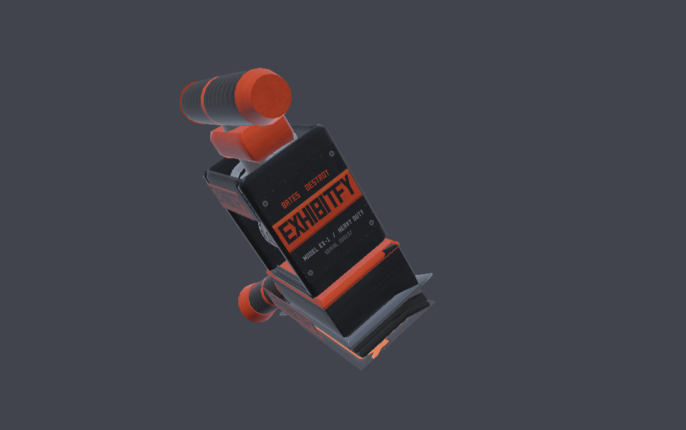

Compact and weapon-like, with the mass deliberately concentrated in the
striking head and the tower slimmed above it — heavy business end, agile shaft.
Roughly 0.27 m tall overall.

- **Striking head** — stepped like a real die: a proud rubber die block, a
  wider rubber backing, then a machined steel sole plate. The step gives the
  face a shoulder that catches light, so the business end reads as the heavy
  end rather than a flat slab.
- **Die face** — `EXHIBITFY` in the condensed all-caps face, double ink rules,
  `EXHIBIT NO.` and a Bates block on its own recessed panel. Bevelled so the
  type reads as raised rubber, and pitched bright enough to hold up in the
  bounce light it actually lives in.
- **Numbering wheels** — six real digit drums behind a window in the front
  faceplate, phased so they display the current Bates number.
- **Housing** — side plates and faceplate carry the wordmark, `BATES &
  DESTROY`, `MODEL EX-1 / HEAVY DUTY` and a serial, with bolt heads and paint
  rubbed back to bare metal along the edges.
- **Handle** — barrelled ribbed rubber grip bar with orange end caps, sized for
  a closed fist and a swinging motion.
- **Foregrip** — side-mounted rubber grip so the support hand has something
  real to hold.

| Die face | Flank |
|---|---|
| 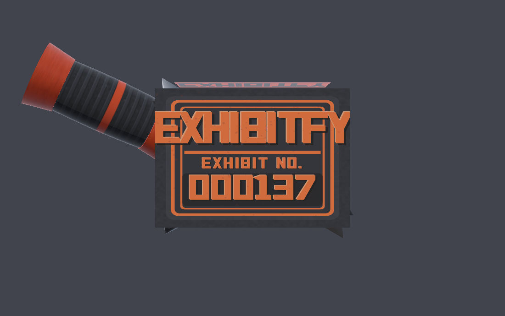 | 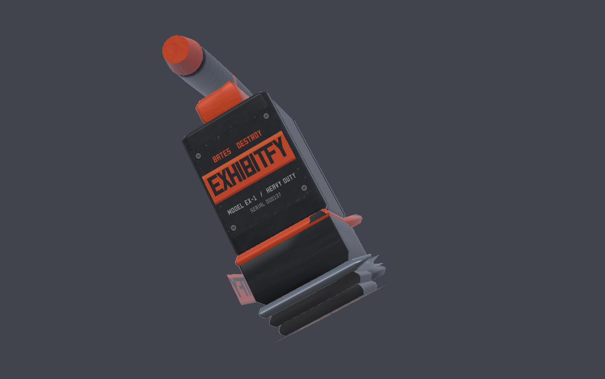 |

### Brand colours

`tools/textures.py` → `BRAND`. Every material, decal and accent reads from this
one dict, so dropping in the exact logo hexes re-skins the whole tool:

```python
BRAND = {
    "orange":    "#D93E15",   # deep red-orange, primary accent
    "orange_hi": "#F2602B",   # lit edge
    "orange_dk": "#8E230A",   # shadowed accent
    "black":     "#121417",   # housing black
    "ink":       "#B8280C",   # stamp ink
}
```

These are my read of "deep red-orange + black". Swap them for the real
Exhibitfy values and re-run the build — nothing else needs to change.

---

## The arms

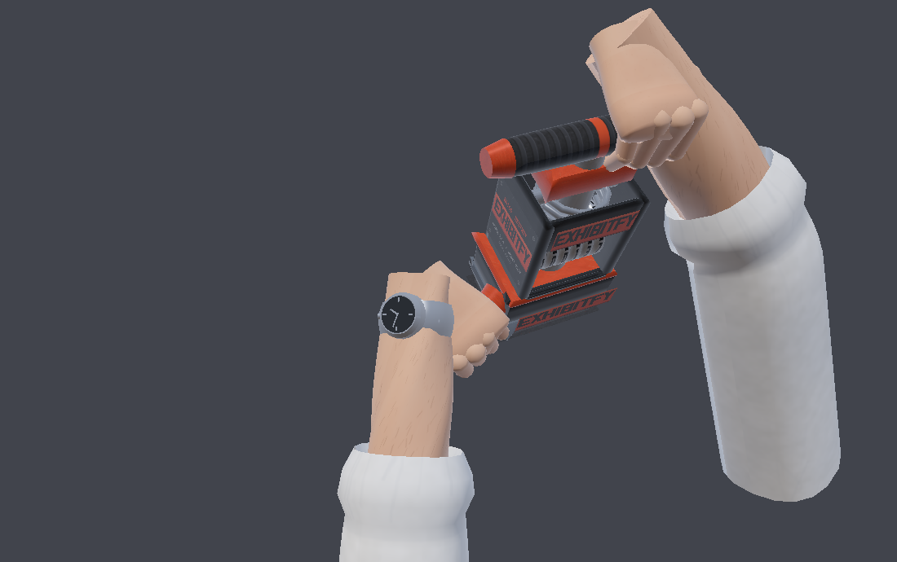

- Male forearms, mid-30s, light skin tone, slightly exaggerated cartoon-realism
  — tapered and athletic rather than brawler-thick.
- Handedness is verified by test, not by eye: for a frame with +Z along the
  fingers and +Y out of the back of the hand, a right hand has its thumb at
  `dorsal x fingers`. Both hands are checked against that sign.
- **The grip is solved, not posed.** `wrap_angles()` wraps each finger chain
  around the cylinder it is actually holding: the first joint is placed by
  circle-circle intersection on the handle's wrap radius, and the rest ride
  around it one chord per phalanx. Move a handle or change its gauge and the
  hands re-close on it correctly. Measured result: every joint on both hands
  sits 0.6–1.8 mm inside the handle surface — contact, not floating.
- **Right hand is the primary swinging hand**, closing hardest with the thumb
  opposed across the front of the fist. The left hand supports on the foregrip
  a shade more relaxed.
- Elliptical cross-sections that flatten toward the wrist, with tendon shading
  and a wrist crease painted into the skin map.
- **Forearm hair**: ~2,200 short curved strokes in the texture, masked to the
  dorsal side and thinning toward the wrist. Texture-only — geometry hair would
  cost more than it is worth on mobile.
- **Sleeves**: white dress shirt rolled to mid-forearm with a doubled cuff roll
  and an inner lip. The sleeve runs well past the elbow and off-camera, which
  holds up when the arms extend on the slam.
- **Watch**: simple silver watch on the left wrist — case, bezel, dark dial,
  quarter markers, hands, crown, and a band that follows the wrist's actual
  cross-section.

| Right-hand grip | Left wrist |
|---|---|
| 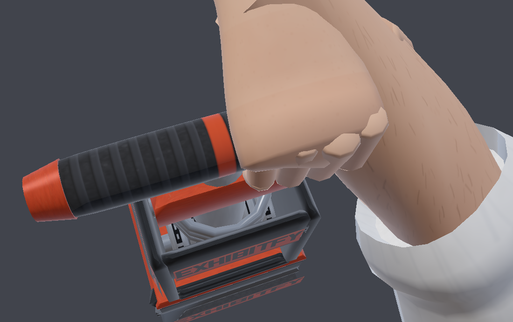 | 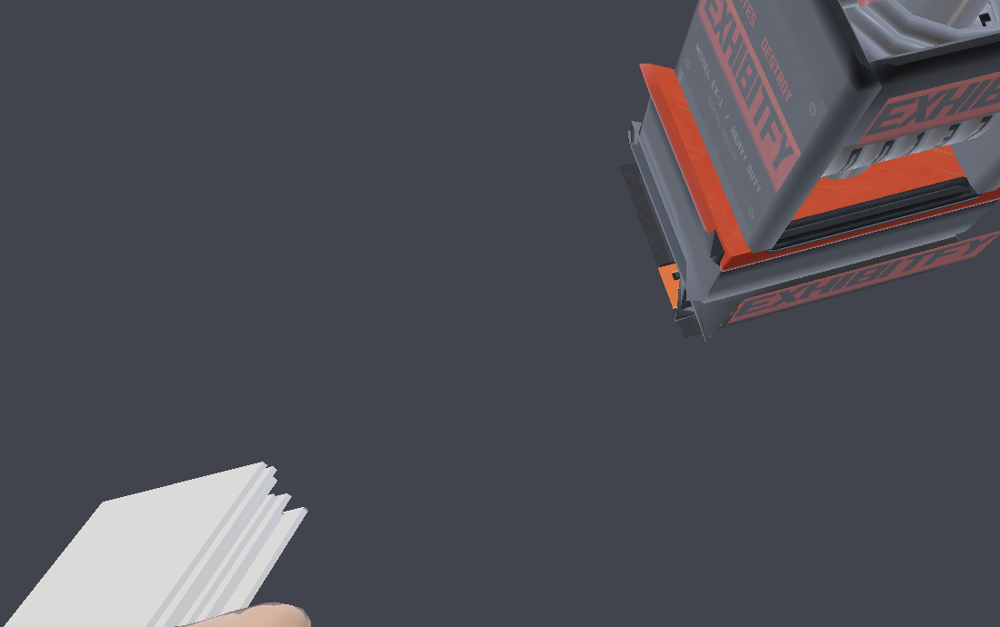 |

---

## Topology

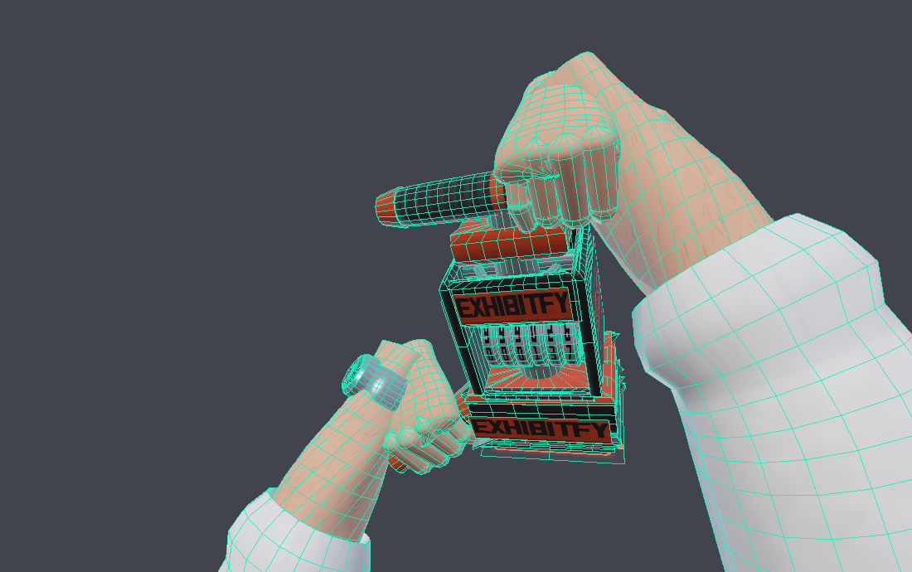

Everything is lofted from rings, so it comes out as continuous edge loops that
survive skinning:

- Forearm: 18-sided rings, 19 loops elbow → wrist. Sleeve: 18-sided, 21 loops.
- Palm: 18-sided rings, 11 loops wrist → knuckles, with thenar and hypothenar
  pads sculpted into the ring radii.
- Fingers: **three jointed bones each** (proximal / middle / distal), every
  one a straight 10-sided capsule in its own node. Straight bones cannot fold
  through themselves the way a single loft swept around a tight curl does, and
  the capsule end caps double as knuckle balls that keep a bent joint closed.
  Every joint is a node, so the fingers are genuinely articulated.
- Hard-surface parts are chamfered rather than raw boxes, and cylinders run
  18–24 sides, so highlights travel smoothly instead of faceting.

Shading is controlled per face by a shading-group id; normals are averaged per
(welded position, group), which gives seamless smoothing across UV seams and
clean hard edges wherever a group changes.

**One thing to know before you rig:** fingers, thumbs and the watch are closed
sub-meshes seated into the palm/wrist rather than welded into a single
continuous skin — the standard low-poly game-hand approach, and what keeps the
finger loops perfectly regular. If you want one welded mesh, bridge the finger
base loops to the palm's knuckle cap in your DCC; the loops are already aligned
for it.

## Scene graph

Nodes carry rigid transforms (rotation + uniform scale + translation) exported
as TRS, which is what lets them be animated at all — glTF forbids `matrix` on
animated nodes.

| Node | Quads | Tris |
|---|---:|---:|
| `TomRexington_FPV_Rig` | | |
| &nbsp;&nbsp;&nbsp;&nbsp;`Stamp_Exhibitfy` | 2444 | 5752 |
| &nbsp;&nbsp;&nbsp;&nbsp;&nbsp;&nbsp;&nbsp;&nbsp;`Stamp_DieAnchor` | | *(locator)* |
| &nbsp;&nbsp;&nbsp;&nbsp;`Arm_R` | 702 | 1458 |
| &nbsp;&nbsp;&nbsp;&nbsp;&nbsp;&nbsp;&nbsp;&nbsp;`Hand_R` | 180 | 396 |
| &nbsp;&nbsp;&nbsp;&nbsp;&nbsp;&nbsp;&nbsp;&nbsp;&nbsp;&nbsp;&nbsp;&nbsp;`Finger_Index/Middle/Ring/Pinky` | 140 ea | 300 ea |
| &nbsp;&nbsp;&nbsp;&nbsp;&nbsp;&nbsp;&nbsp;&nbsp;&nbsp;&nbsp;&nbsp;&nbsp;`Thumb` | 100 | 220 |
| &nbsp;&nbsp;&nbsp;&nbsp;`Arm_L` | 702 | 1458 |
| &nbsp;&nbsp;&nbsp;&nbsp;&nbsp;&nbsp;&nbsp;&nbsp;`Hand_L` + fingers | as right | as right |
| &nbsp;&nbsp;&nbsp;&nbsp;&nbsp;&nbsp;&nbsp;&nbsp;`Watch_L` | 200 | 566 |
| &nbsp;&nbsp;&nbsp;&nbsp;`Impact_Plane` | | *(locator)* |

15 of these nodes are animated: the stamp, both arms, both hands and all ten
digits (31 channels, 23 keys each).

## Materials

All metallic-roughness. Base-colour maps are sRGB; MR maps are linear with
roughness in G and metallic in B, per spec.

| Material | Base colour | Metal | Rough | Maps |
|---|---|---|---|---|
| `Skin_Tom` | texture | 0.0 | tex | skin basecolor + MR |
| `Shirt_White` | texture | 0.0 | tex | shirt basecolor + MR |
| `Steel_Machined` | texture | 1.0 | tex | steel basecolor + MR |
| `Steel_Cast` | `#8E949C` | 1.0 | 0.44 | — |
| `Housing_Black` | texture | tex | tex | housing plain + paint MR |
| `Housing_Exhibitfy` | texture | tex | tex | housing basecolor + MR |
| `Accent_Exhibitfy_Orange` | texture | tex | tex | accent paint + paint MR |
| `Rubber_Base` | texture | 0.0 | 0.95 | rubber grain |
| `Stamp_Die_Face` | texture | 0.0 | tex | die basecolor + MR |
| `Grip_Rubber` | texture | 0.0 | 0.90 | grip basecolor |
| `Bates_Number_Wheels` | texture | 0.85 | 0.34 | wheel digits |
| `Watch_Silver` | `#C9CDD4` | 1.0 | 0.16 | — |
| `Watch_Dial` | `#0E1219` | 0.20 | 0.18 | — |

Black housing, orange accents and rubber all carry their own grain/wear maps
rather than flat colours — a flat fill is what makes hard-surface props read as
plastic toys.

The skin map is a two-band atlas: `v 0.00–0.56` is the forearm (hair,
freckling, tendons), `v 0.60–1.00` is the hand. Hands and forearms therefore
share one 512² sheet and one material.

---

## Tuning it

Five dicts at the top of `build_fpv_arms.py` drive everything:

- `HAND` — palm and finger proportions, and `grip_point`: where a gripped bar
  sits in hand-local space. The grip solver places each hand by mapping that
  point onto a target on the stamp with a chosen axis and dorsal direction, so
  moving a handle automatically moves the hand, wrist, forearm and elbow.
- `STAMP` — every dimension of the tool, in its own local space (origin on the
  striking face, +Y up the tower, +Z front).
- `RIG` — the ready stance: where the stamp sits in view space, how it is
  cocked, which points the hands grip, forearm length and cross-section.
- `IMPACT` — the plane the die is driven into.
- `SWING` — the beats, easing, press depth, wrist lag and grip squeeze.

`python3 -c "import build_fpv_arms as B; [print(r) for r in B.swing_report()]"`
prints the per-frame swing parameter and the signed distance from the die face
to the impact plane — negative means planted.

---

# 2. Enemies — the paper

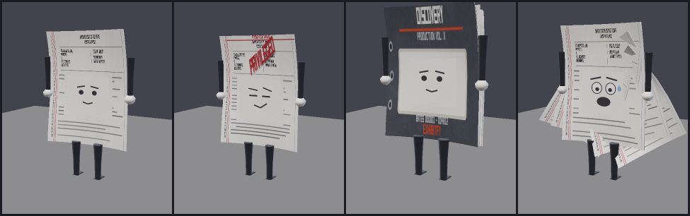

Four anthropomorphic legal documents, built from one parameterised rig so they
share a silhouette language and read as a family. Each is a sheet with real
thickness and natural curl, rubber-hose limbs, and a face drawn on the page.

```bash
python3 build_enemies.py                    # all four + previews
python3 build_enemies.py --only privilege   # one variant
```

| Variant | Tris | Reads as | Run personality |
|---|---:|---|---|
| **Pleading Paper** | 1,392 | White pleading paper, court caption, numbered margin | Energetic, slightly frantic — high cadence, big stride, page flutter |
| **Privilege Paper** | 1,392 | Diagonal red `PRIVILEGED`, red border, smug half-lidded face | Evasive — side-stepping sway on a half-speed dodge cycle, short stride |
| **Thick Discovery Binder** | 2,700 | Dark board cover, `DISCOVERY / VOL. II`, ring binder, punch holes | Heavy — 0.66× cadence, deep bob with a hard landing, minimal arm swing |
| **Chaotic PDF Stack** | 1,856 | Five loose sheets flapping as one unit, panic face | Fastest cadence, biggest flutter, sheets lag the body on their own phases |

The variants are separated on **three** axes at once — page colour/marking,
silhouette, and movement — so they stay distinguishable at gameplay distance
even when small on screen.

## Animations

Both clips are baked every frame at 30 fps.

**`Run`** — one full stride, looping. Cadence sets how many 30 fps frames the
stride takes rather than warping the phase inside a fixed count, so the cycle
closes exactly on the clip boundary and the last key repeats frame 0: 21 keys
for the pleading paper, 19 for privilege, 31 for the lumbering binder, 17 for
the panicking stack. Thigh swing with a knee that folds through the pass,
counter-swinging arms with trailing elbows, a bob that hits twice per stride,
forward lean, and page flutter running against the body.

**`Stamped`** — 26 frames, one-shot. Anticipation, then the page is driven flat
(squash on frame 4), the Bates impression punches in with a 1.28× overshoot,
and it settles limp on the ground.

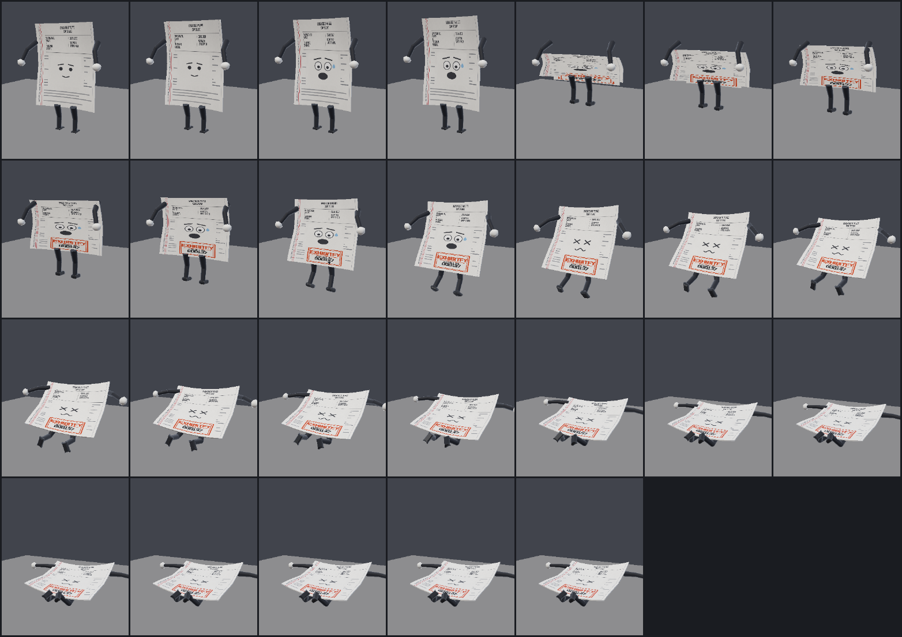

The face changes without swapping textures or UVs: three expression quads
(calm/smug, panic, dizzy) sit on the page and the animation scales the unused
ones to near zero. Same trick reveals the Bates mark. It costs a few triangles
and works on any renderer — no alpha, no UV animation, no material swap.

Every decal is drawn on a **paper-white background** and applied opaque, so its
edges vanish into the page. The page textures leave a blank zone where the face
lands, and the binder puts a white spine label there, so nothing reads as a
sticker.

## Enemy rig

```
Enemy_<variant>
  Rig                 bob, lean, sway
    Torso             page position + rotation (this is what lies down)
      Body            squash/stretch only
        Face_Calm / Face_Panic / Face_Dizzy / Face_Smug
        Bates_Mark
        Sheet_2..5    (stack variant)
      Arm_L/R -> Forearm_L/R
    Leg_L/R -> Shin_L/R
```

The `Torso` / `Body` split matters: arms hang off `Torso` so they travel with
the page when it is knocked flat, but do not inherit its squash. Legs stay on
`Rig` so they crumple independently.

Origin is on the floor between the feet, -Z is forward, so instances drop onto
a floor at y = 0 and face their direction of travel.

---

# 3. Environment — modular law office

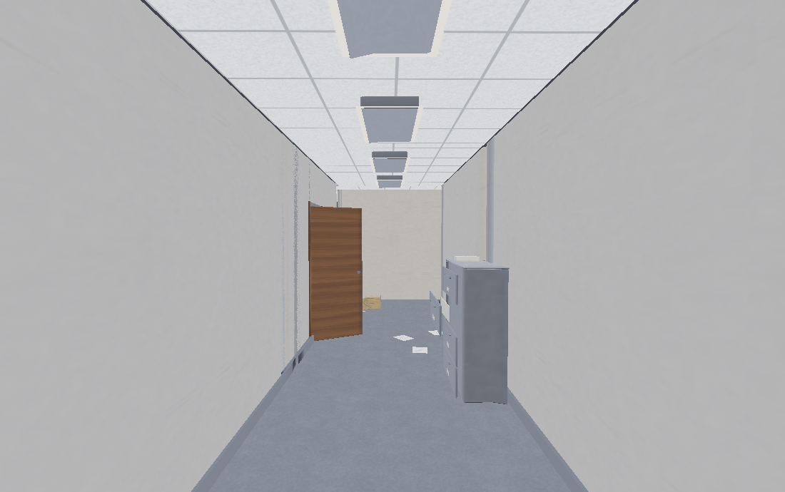

Seven pieces, each exported on its own so they can be instanced and snapped.
Clean but industrial: warm wood, cool gray, fluorescent troffers, and enough
scattered paper and worn edge to look worked in.

```bash
python3 build_environment.py                   # all seven + previews
python3 build_environment.py --only desk_chair
```

| Piece | Tris | Size |
|---|---:|---|
| `hallway_straight` | 1,166 | 4 m module, 2.4 m corridor, two troffers |
| `hallway_corner` | 1,742 | 4 m module, enters -Z, turns out +X |
| `doorway` | 2,016 | 4 m wall, 0.95 × 2.1 m opening, door ajar, nameplate |
| `desk_chair` | 3,110 | 1.6 × 0.78 × 0.745 m desk, task chair, lamp, clutter |
| `file_cabinet` | 3,080 | 1.05 × 0.5 × 1.32 m lateral, one drawer left open |
| `banker_boxes` | 1,546 | Four boxes, one lid off and leaning, spilled paper |
| `reception_counter` | 1,600 | 2.4 m long, 0.745 m work surface, 1.105 m transaction top |

**Kit total: 14,260 triangles.** A corridor run with props in view is ~11k.

## Grid contract

Every piece has its origin **on the floor at the centre of its module
footprint**, with -Z as forward down a corridor. Corridor pieces are 4 m square
in plan and their walls end flush with the module edge, so straights and
corners butt together with no seam. Props sit at y = 0 and are placed by hand.

Scale is first-person real — 2.4 m corridor, 2.8 m ceiling, 2.1 m doors,
0.75 m desks, 1.1 m counter — so a 1.65 m eye height reads correctly. The
first-person preview above is rendered from exactly that height.

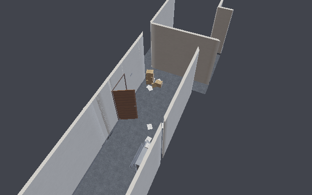

Lighting is built in as geometry: recessed 2×4 troffers with emissive
diffusers, plus a practical desk lamp with its own emissive shade. Subtle mess
is two triangles a sheet — a few papers on the corridor floor, a spill from the
open box, stacks on the desk and cabinet.

Each piece embeds only the textures it actually uses (`Scene.prune()`),
otherwise a seven-piece kit would ship seven copies of the same carpet.

---

# Repository layout

```
build_fpv_arms.py     viewmodel: hands, arms, watch, stamp, pose, swing
build_enemies.py      paper enemies: sheet rig, variants, run + stamped
build_environment.py  modular office kit
web/                  playable browser prototype (three.js, vendored)
tools/
  vec.py              vectors, rigid transforms, quaternions, TRS decomposition
  mesh.py             quad meshes, profiles, lofts, chamfered solids, caps
  imaging.py          float canvas, AA polygon fill, noise, PNG + APNG encoders
  glyphs.py           the condensed bold all-caps typeface, as polygons
  textures.py         every PBR map + the BRAND palette
  gltf.py             scene graph, normals, animation tracks, GLB writer
  objexport.py        quad-preserving OBJ/MTL
  paper_textures.py   pages, faces, the Bates impression
  env_textures.py     carpet, wall, ceiling tile, wood, cardboard, metal
  render.py           software rasteriser for the previews
  validate_glb.py     re-parses the exported GLB and checks it
  glb_roundtrip.py    rebuilds + renders geometry from an exported GLB
  check_solid.py      finds open geometry (meshes with boundary edges)
  blender_stamp_swing.py   Blender-side timeline/action setup
build/                outputs (committed so the assets are usable as-is)
  enemies/  environment/
```

`validate_glb.py` checks chunk framing, accessor and bufferView bounds, index
ranges, unit normals, POSITION min/max, and — for animations — channel/sampler
agreement, strictly increasing key times, unit quaternions, quaternion keys
taking the short way round, and that no animated node carries a `matrix`.

## Notes and caveats

- Previews come from the bundled software rasteriser, not a game engine. It
  approximates IBL with a hemisphere plus a sun lobe, so metals will look
  richer under a real probe.
- Textures are procedural: crisp, tileable and cheap, but not scanned skin. The
  UVs are clean if you want to bake photoreal maps onto them.
- **No skeleton or skin weights.** `Stamp_Swing` is rigid node animation, which
  is why the wrist articulation is deliberately limited — the palm's wrist loop
  is tucked inside the forearm's end loop so small wrist deltas stay hidden.
  Skinning is the natural next step and the loops are laid out to accept it; it
  would also collapse the clip into a single Blender Action.
- The swing was verified by baking, re-parsing the exported GLB and rendering
  every frame here. It has not been opened in Blender or a game engine in this
  environment.
