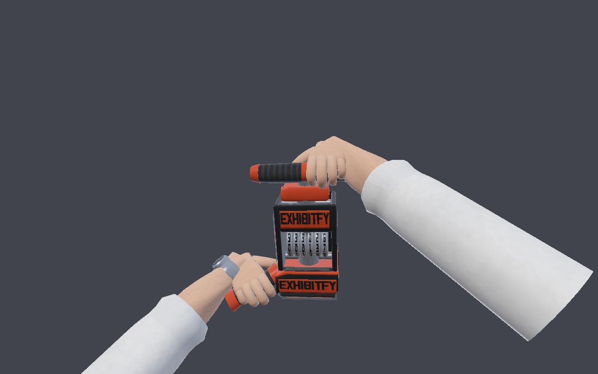

# Tom Rexington, Esq. — FPV arms + Exhibitfy Bates stamp

First-person viewmodel for **Tom Rexington, Esq.: Bates & Destroy**. Forearms
only — no body, no head — in rolled-up white dress shirt sleeves, both hands on
a deliberately oversized Exhibitfy Bates stamp, posed cocked and ready to slam
forward.


Everything here is generated by a dependency-free Python build: geometry,
UVs, PBR textures, the GLB, the editable OBJ, and the preview renders. No DCC
app or third-party package is required to reproduce or re-tune the asset.

```bash
python3 build_fpv_arms.py                 # full build + previews (~100 s)
python3 build_fpv_arms.py --no-preview    # geometry + textures only (~15 s)
python3 build_fpv_arms.py --bates 001842  # change the number on the die/wheels
python3 -m tools.validate_glb build/exhibitfy_fpv_arms.glb
```

---

## What ships

| File | What it is |
|---|---|
| `build/exhibitfy_fpv_arms.glb` | Runtime asset. glTF 2.0, PBR metallic-roughness, textures embedded. 924 KB. |
| `build/exhibitfy_fpv.obj` + `.mtl` | Editable copy with **quads preserved** — import this if you want to keep modelling. |
| `build/textures/*.png` | Every map as authored (13 files), also embedded in the GLB. |
| `build/previews/*.png` | Software renders, including a wireframe pass for topology review. |

**Budget:** 9,574 triangles / 4,194 quads / 6,623 vertices, 13 textures.
That is comfortably inside a mobile viewmodel budget — a typical mobile FPS
allots 8–15k triangles for hands + weapon, and viewmodels are drawn once per
frame in a separate pass.

**Conventions:** metres, Y-up, camera at the origin looking down −Z (glTF
convention). The rig is authored in view space, so dropping it into a
viewmodel camera with an identity transform gives you the framing above.

---

## The pose

Right hand primary on the T-bar up top; left hand supporting on the side
foregrip. The tool is cocked back 24° toward the player, yawed 16° so the
branded flank reads, and rolled 6° for a diagonal that isn't dead symmetric.

| | |
|---|---|
|  |  |
| Ready stance, 3/4 from the left | The `POSE_IMPACT` keyframe — same rig, different numbers |

The die face is deliberately *not* visible in the ready stance: with the tool
cocked to strike, the face points down-and-forward, away from the camera.
That's what makes the slam reveal land. The face is authored at full 1024²
detail for the impact frames and for the paper decal.

---

## The stamp


Black + deep red-orange throughout, industrial but clean, with the wear and
edge-rub concentrated where a real tool takes it.

- **Die face** — `EXHIBITFY` in the condensed all-caps face, a double ink rule,
  `EXHIBIT NO.` and a Bates block on its own recessed panel. Bevelled so the
  type reads as raised rubber. Built to be read the right way round (a real die
  is mirrored; this one is not, on purpose).
- **Numbering wheels** — six real digit drums behind a window in the front
  faceplate, phased so they actually display the current Bates number.
- **Housing** — side plates and front faceplate carry the wordmark, `BATES &
  DESTROY`, `MODEL EX-1 / HEAVY DUTY` and a serial, with bolt heads and
  paint rubbed back to bare metal along the edges.
- **Handle** — barrelled rubber grip bar with ribbing and orange end caps,
  sized for a closed fist and a swinging motion.
- **Foregrip** — side-mounted rubber grip for the left hand, so the support
  hand has something real to hold instead of floating against a flat panel.
- Return spring, plunger head, cross-braces and machined column fill the
  housing so the window has depth behind it.

| Die face | Flank |
|---|---|
|  |  |

### Brand colours

`tools/textures.py` → `BRAND`. Every material, decal and accent reads from this
one dict, so dropping in the exact logo hexes re-skins the whole tool:

```python
BRAND = {
    "orange":    "#D93E15",   # deep red-orange, primary accent
    "orange_hi": "#F2602B",   # lit edge
    "orange_dk": "#8E230A",   # shadowed accent
    "black":     "#121417",   # housing black
    "ink":       "#B8280C",   # stamp ink
}
```

These are my read of "deep red-orange + black". Swap them for the real
Exhibitfy values and re-run the build — nothing else needs to change.

---

## The arms


- Male forearms, mid-30s, light skin tone, slightly exaggerated cartoon-realism
  — strong hands and forearms, but tapered and clean rather than brawler-thick.
- Elliptical forearm cross-sections that flatten toward the wrist, with tendon
  shading and a wrist crease painted into the skin map.
- **Forearm hair**: ~2,200 short curved strokes in the texture, masked to the
  dorsal side and thinning toward the wrist. Texture-only — geometry hair would
  cost more than it's worth on mobile.
- **Sleeves**: white dress shirt rolled to mid-forearm with a doubled cuff roll
  and an inner lip, so it reads as a tube of cloth rather than a shell. The
  sleeve runs well past the elbow and off-camera, which holds up when the arms
  extend on the slam.
- **Watch**: simple silver watch on the left wrist — case, bezel, dark dial,
  quarter markers, hands, crown, and a band that follows the wrist's actual
  cross-section.


---

## Topology


Everything is lofted from rings, so it comes out as continuous edge loops that
survive skinning:

- Forearm: 16-sided rings, 15 loops elbow → wrist. Sleeve: 16-sided, 18 loops.
- Palm: 16-sided rings, 9 loops wrist → knuckles, with thenar and hypothenar
  pads sculpted into the ring radii.
- Fingers: 8-sided, 10 loops each — a loop at every joint plus swell rings over
  the knuckles, so a curl deforms cleanly.
- Hard-surface parts use chamfered edges rather than raw boxes, so they catch a
  highlight and read as machined.

Shading is controlled per face by a shading-group id; normals are averaged per
(welded position, group), which gives seamless smoothing across UV seams and
clean hard edges wherever a group changes.

**One thing to know before you rig:** fingers, thumbs and the watch are closed
sub-meshes seated into the palm/wrist rather than welded into a single
continuous skin — the standard low-poly game-hand approach, and what keeps the
finger loops perfectly regular. If you want one welded mesh, bridge the finger
base loops to the palm's knuckle cap in your DCC; the loops are already aligned
for it.

---

## Scene graph

Nodes carry rigid transforms (rotation + translation only), so the hierarchy is
animation-ready as-is: you can keyframe the stamp, the arms, the hands, or any
individual finger before you commit to a skeleton.

| Node | Quads | Tris | Materials |
|---|---:|---:|---|
| `TomRexington_FPV_Rig` | | | |
| &nbsp;&nbsp;`Stamp_Exhibitfy` | 1882 | 4464 | orange, wheels, grip, black, decal, rubber, die, steel |
| &nbsp;&nbsp;`Arm_R` | 512 | 1072 | shirt, skin |
| &nbsp;&nbsp;&nbsp;&nbsp;`Hand_R` | 128 | 288 | skin |
| &nbsp;&nbsp;&nbsp;&nbsp;&nbsp;&nbsp;`Finger_Index/Middle/Ring/Pinky` | 88 ea | 192 ea | skin |
| &nbsp;&nbsp;&nbsp;&nbsp;&nbsp;&nbsp;`Thumb` | 64 | 144 | skin |
| &nbsp;&nbsp;`Arm_L` | 512 | 1072 | shirt, skin |
| &nbsp;&nbsp;&nbsp;&nbsp;`Hand_L` | 128 | 288 | skin |
| &nbsp;&nbsp;&nbsp;&nbsp;&nbsp;&nbsp;`Finger_*`, `Thumb` | 88 / 64 | 192 / 144 | skin |
| &nbsp;&nbsp;&nbsp;&nbsp;`Watch_L` | 200 | 566 | watch silver, dial |

## Materials

All metallic-roughness. Base-colour maps are sRGB; MR maps are linear with
roughness in G and metallic in B, per spec.

| Material | Base colour | Metal | Rough | Maps |
|---|---|---|---|---|
| `Skin_Tom` | texture | 0.0 | tex | skin basecolor + MR |
| `Shirt_White` | texture | 0.0 | tex | shirt basecolor + MR |
| `Steel_Machined` | texture | 1.0 | tex | steel basecolor + MR |
| `Housing_Black` | `#121417` | 0.25 | 0.44 | — |
| `Housing_Exhibitfy` | texture | tex | tex | housing basecolor + MR |
| `Accent_Exhibitfy_Orange` | `#D93E15` | 0.10 | 0.34 | — |
| `Rubber_Base` | `#17181C` | 0.0 | 0.92 | — |
| `Stamp_Die_Face` | texture | 0.0 | tex | die basecolor + MR |
| `Grip_Rubber` | texture | 0.0 | 0.90 | grip basecolor |
| `Bates_Number_Wheels` | texture | 0.85 | 0.34 | wheel digits |
| `Watch_Silver` | `#C9CDD4` | 1.0 | 0.20 | — |
| `Watch_Dial` | `#0E1219` | 0.20 | 0.18 | — |

The skin map is a two-band atlas: `v 0.00–0.56` is the forearm (hair,
freckling, tendons), `v 0.60–1.00` is the hand (smoother, knuckle darkening,
palm warmth). Hands and forearms therefore share one 512² sheet and one
material.

---

## Tuning it

Three dicts at the top of `build_fpv_arms.py` drive everything:

- `HAND` — palm and finger proportions, and `grip_point`: where a gripped bar
  sits in hand-local space. The grip solver places each hand by mapping that
  point onto a target on the stamp with a chosen axis and dorsal direction, so
  moving a handle automatically moves the hand, wrist, forearm and elbow.
- `STAMP` — every dimension of the tool, in its own local space (origin at the
  centre of the striking face, +Y up the tower, +Z front).
- `RIG` — the pose: where the stamp sits in view space, how it's cocked, which
  points the hands grip, forearm length and cross-section, sleeve and cuff.

`POSE_IMPACT` is a worked example: six overridden numbers produce the full
extension keyframe shown above.

## Repository layout

```
build_fpv_arms.py     the asset build: hands, arms, watch, stamp, pose, export
tools/
  vec.py              vectors, rigid transforms, parallel-transport frames
  mesh.py             quad meshes, profiles, lofts, chamfered solids, caps
  imaging.py          float canvas, AA polygon fill, value noise, PNG encoder
  glyphs.py           the condensed bold all-caps typeface, as polygons
  textures.py         every PBR map + the BRAND palette
  gltf.py             scene graph, normal generation, GLB writer
  objexport.py        quad-preserving OBJ/MTL
  render.py           software rasteriser for the previews
  validate_glb.py     re-parses the exported GLB and checks it
build/                outputs (committed so the asset is usable as-is)
```

## Notes and caveats

- The previews come from the bundled software rasteriser, not a game engine.
  It approximates IBL with a hemisphere + sun lobe, so metals will look richer
  under a real probe than they do here.
- Textures are procedural: crisp, tileable and cheap, but they are not scanned
  skin. If you want photoreal pores, this pipeline gives you clean UVs to bake
  onto.
- No skeleton or skin weights are exported. The node hierarchy is
  animation-ready for rigid keyframing; skinning is the natural next step and
  the loops are laid out to accept it.
