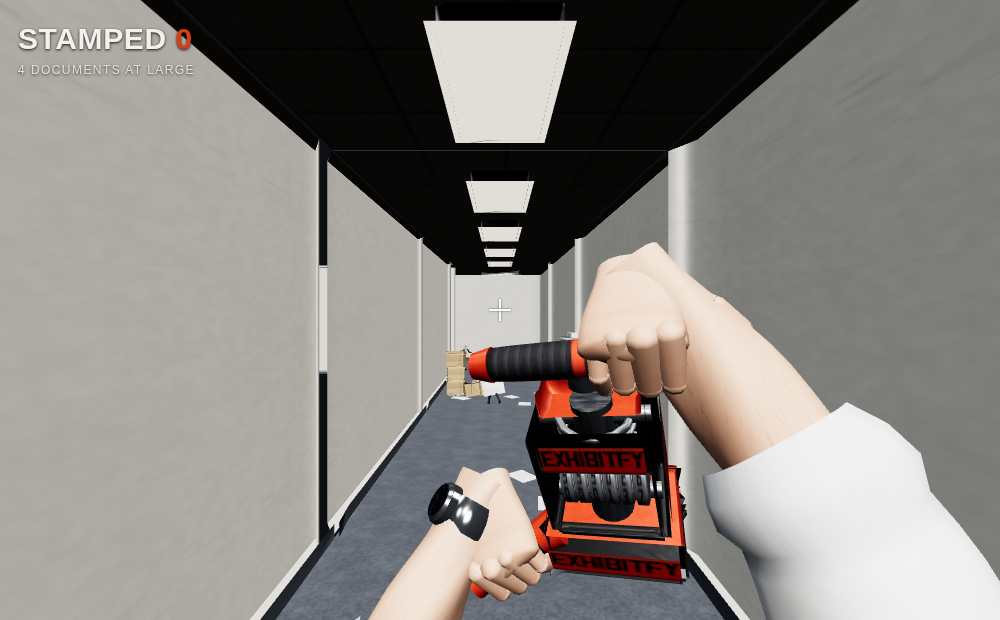
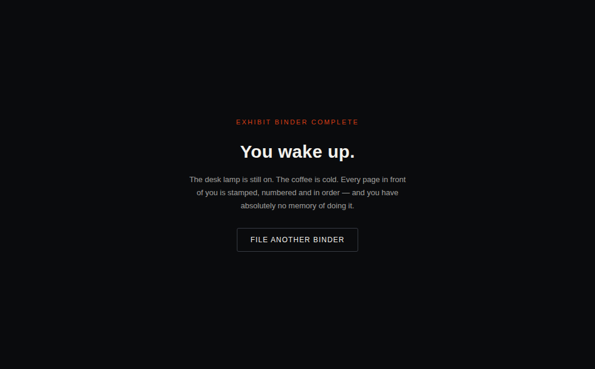
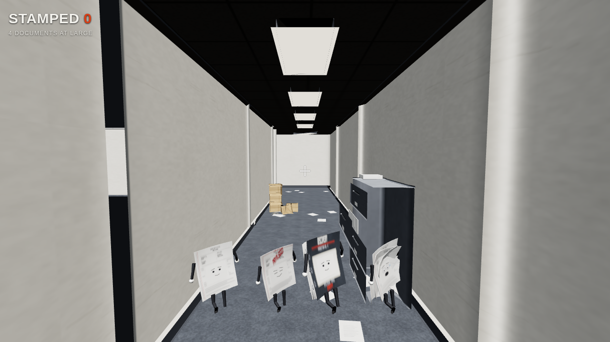

# Playable prototype

A first-person slice of **Tom Rexington, Esq.: Bates & Destroy**, in the
browser. Everything it renders is loaded from the GLBs in `../build` — the FPV
viewmodel with its `Stamp_Swing` clip, all four paper enemies out of the
shared-texture `enemies.glb`, and the modular office kit. No geometry is
authored here.

**[▶ Watch a full run](screenshots/gameplay_demo.webm)** (11.5 s) — captured
from the prototype itself: chasing the four documents down, stamping them,
watching them file themselves into the binder, and the wake screen when the
last one lands.



## Run it

The page loads assets from `../build`, so **serve the repository root**, not
this folder:

```bash
cd /path/to/Exhibitfy-Game
python3 -m http.server 8000
```

Then open <http://localhost:8000/web/> and click to play.

Opening `index.html` as a `file://` URL will **not** work — browsers block
module scripts and asset fetches from the filesystem. Any static server is
fine (`npx serve`, `php -S localhost:8000`, VS Code Live Server); it just has
to be rooted at the repo, not at `web/`.

No internet connection is needed. Three.js r160 is vendored into
`web/vendor/three/` and wired up through an import map, so there is no
third-party CDN dependency — which also matters if this ends up embedded on a
landing page.

## Controls

| | |
|---|---|
| Move | `W` `A` `S` `D` |
| Look | Mouse |
| Stamp | Left click |
| Sprint | `Shift` |
| Release cursor | `Esc` |

You fell asleep assembling a trial binder. Chase the paperwork down and stamp
it — Bates numbering is how exhibits get indexed, so a stamped document isn't
destroyed, it's **filed**: it flattens, takes the impression, then files itself
into the binder you're carrying.

You have **90 seconds** before you wake up, and the binder you assemble in that
time is the evidentiary record you walk into court with. The chaotic stack is the
one that costs you — at 3.33 m/s it is faster than your walk, so it has to be
sprinted down or cornered.

### Ink is the cost of a miss

The stamp holds **seven swings**, and every swing spends one whether it lands or
not. Run it dry and the die still comes down — it just leaves a ghost impression
on the carpet and files nothing, however well you aimed. Refills are the orange
pods, deliberately sited at the dead ends and the far corner rather than along
the route you would walk anyway, so running out costs you a corridor and the
seconds it takes to cover it.

Pods hover at 0.62 m and carry a tapered emissive beacon, both for the same
reason: from the far end of a 12 m corridor the bottle on its own is about
14 × 18 px, low in the frame, against carpet of nearly its own value. You cannot
be asked to detour towards something you cannot pick out.

That chain is the whole point: **miss → burn ink → detour → lose clock → worse
verdict.** Before it existed the swing was free, so there was no reason to aim,
close distance, or fear the clock.

### Objections

Three of them — **Hearsay**, **Character evidence** and **Rule 403** — and they
invert the game. An exhibit runs away and you want to catch it; an objection
comes *at* you and you want it gone. Reaching you does not hurt you, because
there is no health here: it **strikes an exhibit back out of the binder**. 403
takes two.

That is what makes a 90-second clock work as a structure without waves. The
score is no longer monotonic, so the round is a total you defend rather than a
counter you fill, and holding ink back becomes a real decision — your last swing
either files a new exhibit or overrules the objection walking at you.

Overrule one by stamping it, same verb, and it costs the same ink. The window is
the standoff band between the range you can stamp one at (~2.4 m) and the range
at which it strikes (1.0 m): about a second for hearsay, 0.7 s for 403. All
three are slower than your walk, so breaking off and dealing with one later is
always available.

A rule only appears once the binder holds enough to be worth striking — character
evidence is not relevant until you have put character at issue — so an objection
never lands on an empty binder.

### Closing the binder

A complete binder is not an instant win. It has to be **held for three seconds**,
and an objection that lands inside that window takes an exhibit back out and the
round carries on. Without the hold, filing the fourth exhibit ended the round on
the same frame, which cancelled the whole point of objections: they could
pressure the middle of a round but never touch a finished binder.

### The bonus round

Closing the binder used to buy nothing — beat the clock by a minute and you got
the same screen as someone who scraped it. Close it with **32 seconds still on
the clock** and opposing counsel moves for **summary judgment** instead: a boss
round on a fresh 40-second clock.

The motion has **eight pages** and a Bates stamp is exactly the tool for that, so
the only health bar in the game is really a page count. Each stamp numbers a page
and knocks it back half a metre; it keeps calling objections in its own defence.
Number all eight and the motion is denied — **Lawyer of the Year**, the one
ending above `Verdict for the defense`.

You can only lose the *bonus*, never the case: the binder was closed before any
of it began, so if the motion reaches you summary judgment is granted, the round
ends, and the verdict on the binder still stands. The endings say so explicitly,
because losing a round you were awarded for winning otherwise reads as a
punishment.

`enemy_motion.glb` is fetched **on qualification, not at boot** — 664 KB is too
much to charge every player to discover they were too slow. If it fails to load
the case is awarded rather than leaving the player in an empty round.

### The verdict

You do not win or lose so much as get a ruling, graded on how much of the binder
is in order. A full binder takes the case; three of four draws an adverse
inference on the exhibit you never authenticated; below that the court starts
directing verdicts and entering judgment. Filing three used to be
indistinguishable from filing none, which made partial competence invisible.

## How it works

**Movement** is clamped to a set of walkable rectangles derived from the
layout, rather than colliding against wall meshes. For a prototype on a grid
kit that is both cheaper and far more reliable — you cannot fall through a
seam. Blocked axes are resolved separately so you slide along walls instead of
sticking.

**The viewmodel** is drawn by a second camera into its own scene, composited
over the world with a depth clear. That is the standard first-person weapon
trick and it means the arms never clip into a wall you stand against. The rig
is authored in view space with the camera at the origin looking down −Z, so it
drops in with no offset.

**The swing** plays the baked `Stamp_Swing` clip. Hit resolution fires once, on
the frame the die is actually planted (frame 11 of 23, so 0.367 s in) rather
than on click — so the hit lands when the stamp lands.

The strike is a **sphere centred 1.05 m ahead of the eye**, not a cone from the
camera. A cone degenerates at point-blank range: enemies do not block you, so
you routinely end up standing on top of one, and the angle to something at
0.2 m is meaningless. The sphere behaves the same at every distance.

**Lighting** uses a generated `RoomEnvironment` probe. Without an environment
map every metallic surface in the kit — the watch, the stamp's steel, the
cabinet — renders black, since there is nothing for them to reflect.

**The viewmodel camera runs at the same FOV as the world camera.** A narrower
one blows the arms up until they cover the middle of the screen, which is
exactly where enemies appear.

**Filing** is what a hit actually does. A stamped document lies flat for the
length of the `Stamped` clip, then arcs up, tumbles, shrinks and homes on the
binder below your eye. The HUD counts filed exhibits rather than kills, and
filing the last one closes the binder: the wake screen fades up and releases
the cursor.



**Enemies** run the looping `Run` clip, flee once you are close enough, wander
at reduced speed otherwise, and turn on the spot when cornered. Getting
stamped cross-fades to the one-shot `Stamped` clip, which flattens the sheet
and leaves the Bates impression on it.

All four variants are on the floor, one of each:



| | Speed | Flees at | Turn (rad/s) | Behaviour |
|---|---:|---:|---:|---|
| Pleading Paper | 2.45 m/s | 7.0 m | 3.2 | the baseline |
| Privilege Paper | 2.25 m/s | 9.1 m | 4.0 | bolts early and **weaves** instead of running straight |
| Discovery Binder | 1.20 m/s | 5.6 m | 1.8 | lumbers, turns badly, but is a wider target |
| Chaotic PDF Stack | 3.33 m/s | 8.1 m | 4.3 | faster than your walk (3.1 m/s) — sprint, or cut it off at a corner |

Those speeds are not invented for the prototype: each tracks the cadence and
stride actually baked into that variant's `Run` clip, so the feet keep pace
with the ground instead of skating. The binder is half the pleading paper's
speed because its stride is both shorter and slower.

The privilege paper's long evasive weave lives here rather than in its clip. A
weave slower than one stride cannot be baked into a one-stride loop — half a
cycle does not close, and it used to pop at the seam. On the heading it also
does something the clip never could: make the thing genuinely harder to hit.

## Weight

| | |
|---|---|
| Page + script | 21.5 KB |
| Three.js (vendored) | 820 KB on disk, ~180 KB gzipped over the wire |
| Assets actually fetched | 4.83 MB (viewmodel, seven enemies, eight kit pieces) |
| Music bed | 381 KB fetched — one of the two encodings, never both |

The enemies used to be 2.9 MB of that, as four self-contained GLBs. They could
not share a texture, so `paper_pleading` shipped three times and the face and
Bates maps four times each — **1.12 MB of byte-identical pixels**. They now come
from one `enemies.glb` (1.86 MB, six unique images instead of fourteen), which
is one request instead of four and one GPU upload of each map instead of four.
The per-variant files still ship as the art deliverable; the prototype just
does not fetch them.

Nothing here is geometry — the whole kit is ~14k triangles, and all four
enemies together are 7,340. What is left is genuinely textures: the viewmodel
is 1.2 MB of embedded PNGs and the six enemy maps are most of the rest. The
next real cut is authored resolution (the page maps are 1024², the rest 512²),
weighed against the legal headers staying readable at distance. KTX2/Basis
would beat both, but it needs a third-party encoder, which the pipeline's
standard-library-only rule does not allow — that one has to be raised, not
adopted quietly.

## Sound

Effects are synthesized on a WebAudio graph at play time — swing, stamp, the
riffle of a document filing itself, the wake clock, and a sting per ending.
There are no effect samples to ship.

The music bed is a file, `audio/calm_loop.*`, 31.2 s stereo. It ships twice
because no single encoding covers every browser: Opus-in-Ogg (381 KB) and
AAC-in-M4A (521 KB). The page asks `canPlayType` which it prefers and fetches
only that one, falling back to the other if the decode throws — Chromium builds
without the proprietary codecs cannot read AAC, and Safari only grew Opus
support recently.

It is not looped with `source.loop`. The track is level across the wrap but does
not butt-join at sample level, so plain looping steps 0.178 across the seam
every 31.2 s; consecutive passes are equal-power crossfaded instead, which
measures 0.019 at the join for about a decibel of level through the overlap.

## Known limits of this slice

- No score persistence.
- The bed is one 31.2 s loop with no variation and no reaction to the clock
  running down.
- Nothing can damage *you* — objections cost you exhibits, not health, so there
  is no reason to retreat from anything except to buy time.
- One layout, four documents, no waves and no difficulty curve beyond the
  objections arriving. A fast player can still close the binder before the first
  one spawns at 22 s — that now earns the bonus round rather than skipping
  content, but it does mean the objections themselves can go unmet.
- The boss only walks at you and calls objections. It has no attack of its own
  beyond arriving, so the fight is a kiting exercise rather than a pattern to
  learn.
- Objections path by hunting and wall-sliding like the exhibits, so they grind
  corners the same way.
- Enemies path by fleeing and wall-sliding, not by navmesh — they can get
  briefly stuck grinding a corner before they turn out of it.
- One of each variant spawns, and that is the whole roster — there is no wave
  system, respawn, or difficulty curve.
- Collision is the walkable-rectangle set, so props (desks, boxes) do not block
  you — you walk through them.
